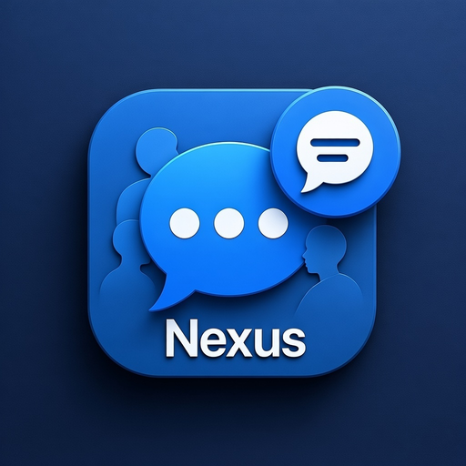

<div align="center">

# Nexus Chat



**A Modern Real-time Chat Application**

[](https://vuejs.org/)
[](https://www.electronjs.org/)
[](https://vitejs.dev/)
[](https://element-plus.org/)
[](LICENSE)

English | **[简体中文](./README.md)**

</div>

---

## Introduction

Nexus Chat is a cross-platform real-time chat application built with Vue 3 and Electron. It supports both web browsers and desktop applications (Windows, macOS, Linux), providing a smooth chatting experience with rich social features.

## Features

| Icon | Feature |
|:----:|---------|
| 💬 | **Real-time Communication** - Instant messaging based on WebSocket |
| 🖥️ | **Cross-platform Support** - Both web browser and desktop applications |
| 👥 | **Group Chat** - Create groups, manage members, set administrators |
| 📇 | **Contact Management** - Friend requests, online status display |
| 👤 | **User Profile** - Custom avatar, background, social links |
| 🌐 | **Internationalization** - Chinese and English interface support |
| 🔍 | **Message Search** - Quick search through chat history |
| 📁 | **File Transfer** - Support for images and file sharing |

## Tech Stack

| Category | Technology |
|:---------|:-----------|
| Frontend Framework | Vue 3 + Composition API |
| State Management | Pinia |
| Router | Vue Router 4 |
| UI Library | Element Plus |
| Build Tool | Vite 5 |
| Desktop Framework | Electron 28 |
| Real-time Communication | STOMP.js + SockJS |
| HTTP Client | Axios |
| i18n | Vue i18n |

## Project Structure

```
Nexus-Chat/
├── 📂 src/
│   ├── 📂 components/        # Reusable components
│   │   ├── 📂 chat/          # Chat components
│   │   ├── 📂 contact/       # Contact components
│   │   ├── 📂 layout/        # Layout components
│   │   └── 📂 common/        # Common components
│   ├── 📂 views/             # Page views
│   ├── 📂 stores/            # Pinia state management
│   ├── 📂 services/          # API and WebSocket services
│   ├── 📂 locales/           # i18n files
│   ├── 📂 styles/            # Global styles
│   └── 📂 router/            # Router configuration
├── 📂 electron/              # Electron main process
├── 📂 public/                # Static assets
└── 📂 dist/                  # Build output
```

## Quick Start

### Requirements

- Node.js >= 18.0.0
- npm >= 9.0.0

### Installation

```bash
# Clone the repository
git clone https://github.com/AngkinV/Nexus-Chat.git

# Navigate to project directory
cd Nexus-Chat

# Install dependencies
npm install

# Start web development server
npm run dev:web

# Or start Electron development mode
npm run dev
```

### Build

```bash
# Build for web
npm run build

# Build for macOS
npm run electron:build:mac

# Build for Windows
npm run electron:build:win
```

## Configuration

| File | Purpose |
|:-----|:--------|
| `.env.development` | Development environment |
| `.env.production` | Production environment |
| `.env.electron` | Electron environment |

```env
VITE_API_BASE_URL=http://localhost:8080/api    # API server address
VITE_WS_URL=http://localhost:8080/ws           # WebSocket server address
```

## Related Projects

| Project | Description |
|:--------|:------------|
| [Nexus Backend](https://github.com/AngkinV/nexus) | Backend Service |

## License

This project is licensed under the [MIT](LICENSE) License.

---

<div align="center">

**Made with ❤️ by Nexus Team**

</div>
